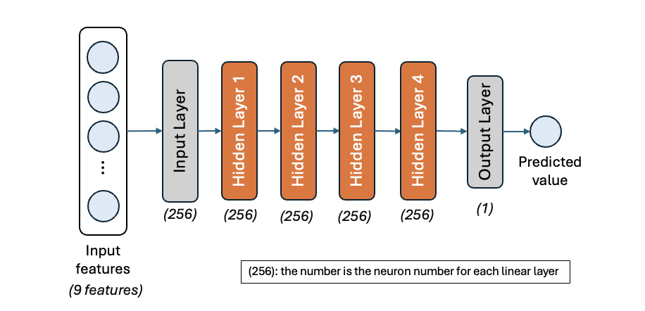

# Neural Network from Scratch

This project contains two parts:  

1. **Part 1 - NN library from scratch (NumPy only):** Implements core neural network components, including linear layers, activation and loss functions, forward and backward propagation, mini-batch SGD updates, a simple training loop, and data preprocessing. 
2. **Part 2 - House value regression:** Applies Pytorch library to predict median house prices in California using a fully connected neural network, including preprocessing, model training, and evaluation.

## Project Structure

```
.
├── part1_nn_lib.py                    # NumPy-only NN library + example_main()
├── part2_house_value_regression.py    # Uses the Pytorch library for regression
├── iris.dat                           # Example dataset for Part 1 (Iris, one-hot labels)
├── requirements.txt
└── README.md
```

## How to Run

```bash
python part1_nn_lib.py
python part2_house_value_regression.py
```

Each script will automatically execute the `example_main()` function.
 

## Part1: NN library from scratch

This file includes four main classes `Layer`, `MultiLayerNetwork`, `Trainer` and `Preprocessor`. 


1. **Layer:** Implements the foundational building blocks of the neural network, including:
    - **LinearLayer:** affine transformation with Xavier initialization
	- **Activation layers:** SigmoidLayer, ReluLayer
	- **Loss layers:** MSELossLayer, CrossEntropyLossLayer

2. **MultiLayerNetwork:**  Constructs a full neural network by stacking linear and activation layers.
Supports forward propagation, backward propagation, and parameter updates across all layers.

3. **Trainer:** Defines the training process, including:
	- Epoch iterations and mini-batch division
	- Forward → Loss → Backward → Parameter update loop
	- Optional dataset shuffling per epoch
	- Optimization method: Mini-batch Stochastic Gradient Descent (SGD)

4. **Preprocessor:**
Handles data normalization with min–max scaling and can revert processed data to its original scale.

## Part 2: House value regression

This part demonstrates how to use the PyTorch neural network library to predict median house prices in California.
It covers the full end-to-end workflow, including data preprocessing, model architecture design, training, and performance evaluation.

### Model Architecture

| Component | Description | 
| --- | --- |
| Input Layer | Number of neurons = number of input features after preprocessing |
| Hidden Layers |  2–5 fully connected layers (default: 2) with 64–256 neurons each |
| Activation | ReLU after each hidden layer (Mitigates vanishing gradients and speeds up training) |
Dropout | 20% rate to prevent overfitting |
| Output Layer |Single neuron with linear activation for regression | 
| Loss Function | Mean Squared Error (MSE) |
| Optimizer | Adam (adaptive learning rate) | 




The model takes **9 input features**, passes them through **4 hidden layers** with **256 neurons each**, and outputs a **single scalar prediction** for house value *(after hyperparameter tuning)*.  

### Data Preprocessing 

1. **Handling Missing Values:** The total_bedrooms column contained missing values. These were imputed using the median, which is more robust to outliers and skewed distributions.
2. **Encoding Categorical Variables:** The ocean_proximity feature was one-hot encoded to convert categorical data into numerical form suitable for neural network input.
3. **Normalization:** All numerical features were standardized using Z-score normalization, preserving relative scaling while reducing the influence of extreme values.

### Evaluation Metrics: 

1.	**Mean Squared Error (MSE):** Measures the average squared difference between actual and predicted values.
2.	**Root Mean Squared Error (RMSE):** The square root of MSE, expressed in the same units as the target variable (house prices), making it more interpretable.
3.	**R² Score:** Represents the proportion of variance in house prices explained by the model. The values closer to 1 indicate better fit.
4.	**Adjusted R² Score:** Adjusts the R² score for the number of features, preventing artificial improvement when more features are added.

### Model Selection:

To identify the best-performing network configuration, we conducted hyperparameter tuning using the `Ray Tune` library for distributed search.

The tuning process explored combinations of the following hyperparameters:

| Hyperparameter | Search Space | 
| --- | --- |
| Hidden layer size | {32, 64, 128, 256} |
| Number of hidden layers | {2, 3, 4, 5} |
| Learning rate | {0.01, 0.005, 0.001} | 
| Batch size | {64, 128} | 
| Dropout rate | {0.2, 0.3, 0.4} | 
| Epochs | {1000, 2000} | 

### Search Strategy:
- Each experiment trained a full model on a 90% training subset and evaluated it on a 10% validation subset.
- The objective metric was MSE on the validation set.
- Ray Tune coordinated multiple experiments in parallel, automatically reporting intermediate results and selecting the best configurations.

    | Best Hyperparameter Found | Value | 
    | --- | --- |
    | Hidden layer size |  256 |
    | Number of hidden layers | 4 |
    | Learning rate | 0.001 |
    | Batch size | 64 |
    | Dropout rate | 0.2 |
    | Epochs | 2000 |


### Experimental Results
- Increasing hidden layer size improved validation RMSE and R² up to 256 neurons.
- Adding too many layers (5+) led to overfitting, where training loss decreased but validation loss increased.
- The 4 hidden layer, 256 neuron model achieved the best trade-off between accuracy and generalization.
- Error distribution was approximately normal, centered near zero. No major bias are detected.

---

### Acknowledgement

- **Program:** MSc Computing, Imperial College London
- **Module:** Machine Learning
- **Assignment:** Neural Network from Scratch